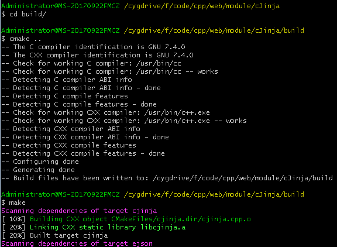
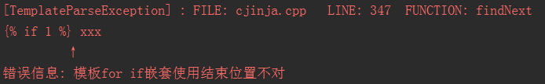

### 介绍

cJinja 是一个使用cpp编写的轻量html模版解析库，依赖 [ejson](https://github.com/HuangHongkai/ejson) (https://github.com/HuangHongkai/ejson) 来实现模版的数据替换（在jinja中称为context，上下文）。模版的语法基本与django jinja一致，功能还算丰富。源码仅有700行，适合学习，觉得不错的点个star吧。

（该程序为 https://github.com/HuangHongkai/tinyserver 中的一个模块）

### 编译

使用cmake来编译，windows和linux下均可编译。推荐使用clion作为IDE。



编译成功后在build目录下会有libcjinja.a和cjinja_test.exe这2个文件。libcjinja.a是静态库，cjinja_test.exe是一个简单的测试程序。

运行测试程序后会出现output.html（该文件是tmp.html解析后的结果。）


### 已经完成的功能

- 变量，例如 {{ var }}
- 变量索引访问，例如  {{ var.var2 }} {{ var[2] }} {{ var[2].key.value[2] }}，其中**[]** 表示对数组（类似python的list）进行索引， **.** 表示对object进行索引（类似与python的dict）
- 表达式计算(包括字符串拼接) ，例如{{ 1\*1+2-3\*var }} {{ 1+1\*2-3/4 }} {{ "asdfsf"+var }}
- for-endfor对列表进行迭代, 例如  
- for-endfor对对象进行迭代，例如   或者  或者  
- if-else-endif 语句, 其中if的条件支持四则运算，简单的比较（!= == ）等，例如 aaabbb
- 模版包含，嵌套其他的模版文件
- 模版语法错误提示 

需要注意，**表达式之间不能含有空格，例如{{ 1 + 1 }}是非法的，而{{ 1+1 }}是合法的。**

### 使用方法

#### 1. 变量和变量索引

简单的例子如下，

```cpp
HtmlTemplate html("username:{{ username }}\n"
                  "parm.list[1][2]: {{parm.list[1][2] }} \n"
                  "parm.key: {{ parm.key }}",
                 1); // 参数1表示传入的是模版字符串，0表示传入的是文件名，默认为0
JSONObject obj = {
    {"username", 1234},
    {"parm", {
        {"key", "cde"},
        {"list", {1, {1,2.3, "abcd"}, "hahaha"}},
    }}
};
html.setValue(obj);
cout << html.render() << endl << endl;
/* 运行后打印如下
username:1234
parm.list[1]: abcd 
parm.key: cde
*/
```

HtmlTemplate是一个库的主要类，构造函数为 

`explicit HtmlTemplate(const string& str, int flag = 0); // flag=0是str表示文件路径，不为0是表示传入的模版字符串` 

其中str参数为字符串，可以表示html模板原始串，也可也表示为文件的路径，flag默认为0。

**setValue** 方法表示传入数据给模版对象。

**render()** 方法表示将模版解析成字符串。

JSONObject来源于 [ejson](https://github.com/HuangHongkai/ejson) 库，用来模拟python的dict，构造函数也比较容易看懂。

#### 2. 列表迭代

```cpp
HtmlTemplate html("{{ x }}\n"
                  "此时x已经是临时变量了，不可以在打印了 {{x}}\n"
                  , 1);

JSONObject obj = OBJECT(
    KEYVALUE("list", LIST(1,2,3,4,5))
);
cout << html.setValue(obj).render() << endl << endl;
/*运行后输出如下
1
2
3
4
5
此时x已经是临时变量了，不可以在打印了 
*/
```

注意到在迭代过程中x是作为临时变量，在外部的话是无法打印出来的。

#### 3. 字典迭代

```cpp
HtmlTemplate html("迭代1: 字典的key值为 {{ key }}\n"
                  "迭代2: 字典的key值为 {{ key }}, value值为 {{ value}}\n"
                  "迭代3: 字典的value值为 {{ value }}\n", 1);
JSONObject obj = OBJECT(
    KEYVALUE("dict", OBJECT(
        KEYVALUE("key1", "value1"),
        KEYVALUE("key2", 1234),
        KEYVALUE("key3", nullptr),
    ))
);
cout << html.setValue(obj).render() << endl << endl;
/*运行后输出
迭代1: 字典的key值为 key1
迭代1: 字典的key值为 key2
迭代1: 字典的key值为 key3
迭代2: 字典的key值为 key1, value值为 value1
迭代2: 字典的key值为 key2, value值为 1234
迭代2: 字典的key值为 key3, value值为 null
迭代3: 字典的value值为 value1
迭代3: 字典的value值为 1234
迭代3: 字典的value值为 null
*/
```

#### 4. 字符串拼接与表达式计算

```cpp
HtmlTemplate html("{{ a+b+c+\"444\" }}\n"
                  "{{x}} * {{y}} + 2 * 3 - 4 / {{x}} = {{ x*y+2*3-4/x }}\n",
                      1);
JSONObject obj = OBJECT(
            KEYVALUE("a", "111"),
            KEYVALUE("b", "222"),
            KEYVALUE("c", "333"),
            KEYVALUE("x", 12),
            KEYVALUE("y", 34)
 );
cout << html.setValue(obj).render() << endl << endl;
/*运行后输出
111222333444
12 * 34 + 2 * 3 - 4 / 12 = 413.667
*/
```

#### 5. if-else-endif语句

```cpp
HtmlTemplate html(" 1==1 成立  1==1不成立 \n"
                  " x为空  x不为空 \n"
                  " x==2 成立 \n"
                  " x+1!=2 成立 \n"
                  " x<3 成立 \n"
                  " x>1 成立 \n"
                  " str为abcd \n"
                  " 常量表达式1 \n"
                  " 常量表达式0，此处不会输出 ", 1);
JSONObject obj = {
    {"x", 2},
    {"str", "abcd"}
};
cout << html.setValue(obj).render() << endl;
/*运行后输出
 1==1 成立 
 x不为空 
 x==2 成立 
 x+1!=2 成立 
 x<3 成立 
 x>1 成立 
 str为abcd 
 常量表达式1 
*/
```

#### 6.for与if嵌套使用  

```cpp
 HtmlTemplate html(""
                       ""
                            ""
                                "{{x}} * {{y}} = {{ x*y }}\n"
                            ""
                       ""
                            "x的值为空\n"
                       ""
                   "", 1);
JSONObject obj = OBJECT(
    KEYVALUE("list", LIST(1,2,3,4,5)),
    KEYVALUE("list2", LIST(1,2,3)),
);
cout << html.setValue(obj).render() << endl << endl;
/*运行后输出
1 * 1 = 1
1 * 2 = 2
1 * 3 = 3
2 * 1 = 2
2 * 2 = 4
2 * 3 = 6
3 * 1 = 3
3 * 2 = 6
3 * 3 = 9
4 * 1 = 4
4 * 2 = 8
4 * 3 = 12
5 * 1 = 5
5 * 2 = 10
5 * 3 = 15
*/
```

#### 7.模版文件作为输出

```cpp
HtmlTemplate html("tmpl.html");
JSONObject context = OBJECT(
    ...
);
FILE* f = fopen("output.html", "w"); // 写入到文件中
string&& str = html.setValue(context).render();
fwrite(str.c_str(), 1, str.size(), f);
fclose(f);
/*运行后，代开当前目录的tmpl.html文件作为输入，输出文件为output.html*/
/*如果tmpl.html不存在则抛出异常*/
```

#### 8. 异常处理

```cpp
HtmlTemplate html(" xxx ", 1);
// 不传入context
try {
    cout << html.render() << endl;
} catch(exception& e) {
    cerr << e.what() << endl;
}
cout << endl;
```

运行后终端上打印如下，



会提示异常的类名，异常文件所在位置，代码行数，以及一些错误的信息。


#### 讨论

##### 1. 实现一个简单的表达式计算器用什么方法比较好?（例如 {{ 2.3\*3+4/5\*x }} 这类表达式）

我分享一下我自己的方法，有什么更好的方法一起讨论一下。

- 第一步，先把数据和符号提取出来放入到数组中，输入类型全部设为double。例如上面那个表达式，符号提取出来是{\*, /, \*}, 数据提取出来是{2.3, 3, 4, 5, x} 

  这一步位于__parse_var这个函数，比较简单不详细讨论。

- 第二步，先计算乘除法，结果放入栈中，在对栈中元素计算加减法（按照我们平常计算表达式的思路先乘除后加减），这一步实现如下(其中运用到C语言的宏和C++11的匿名函数)

  ```cpp
  double cJinja::HtmlTemplate::calculator(vector<any>& number, vector<char>& op) {
      // 例如下表达式会成为
      // 1 - 2 - 3 + 2 *3 * 4 - 4*5
      // vector<char> op = { '-', '-', '+', '*', '*', '-', '*' };
      // vector<any> number = { 1, 2, 3, 2, 3, 4, 4, 5 };
      if (number.size() != op.size() + 1)
      throwException(TemplateParseException, "运算符号数和操作数不匹配");
  
      /* 定义计算器的内部函数 */
      auto calc = [](any& var1, double var2, char op) -> double{
          // var2 + var1
          // var2 * var1
          // var2 - var1
          // var2 / var1
          // 注意顺序
  #define CALC(op2) \
      if(#op2[0] == op) { \
          if (var1.type() == typeid(int)) \
              return var2 op2 static_cast<double>(any_cast<int>(var1)); \
          else if (var1.type() == typeid(float)) \
              return var2 op2 static_cast<double>(any_cast<float>(var1)) ; \
          else if (var1.type() == typeid(double)) \
              return var2 op2 static_cast<double>(any_cast<double>(var1))  ; \
      }
          CALC(+);
          CALC(-);
          CALC(*);
          CALC(/);
          throwException(TemplateParseException, "不允许对空指针进行运算");
  #undef CALC
      };
  
      vector<double> num_stack; // 计算中间结果存储栈
      num_stack.push_back(calc(number[0], 0, '+')); // 获取值  number[i+1] + 0 (加法运算零元为0，乘法运算零元为1)
      /* 计算 * / 法*/
      for (size_t i = 0; i < op.size(); i++) {
          if (op[i] == '+' || op[i] == '-') {
              num_stack.push_back(calc(number[i + 1], 0, '+')); // number[i+1] + 0
          }
          else if (op[i] == '*' || op[i] == '/') {
              double var1 = num_stack.back(); num_stack.pop_back();
              num_stack.push_back(calc(number[i + 1], var1, op[i])); // var1/number[i+1] 或者是  var1/number[i+1]
          } else
          throwException(TemplateParseException, str_format("非法操作符 %d", op[i]));
      }
      /* 计算 + - 法*/
      double result = num_stack[0];
      size_t i = 1;
      for (auto& ch : op) {
          if (ch == '+') {
              result += num_stack[i++];
          } else if(ch == '-') {
              result -= num_stack[i++];
          }
      }
      return result;
  }
  ```

  

#### 2. 抛出异常包含更多的信息

我定义了一个throwException宏，如下

```cpp
#define throwException(Exception, ...) { \
        std::cerr << "[" << #Exception << "] : FILE: " << string(__FILE__).substr(string(__FILE__).find_last_of('/') + 1) << "   LINE: " << __LINE__ <<  "  FUNCTION: " <<__FUNCTION__ << std::endl; \
        throw Exception(__VA_ARGS__); \
    }
```

其中`__FILE__` 为文件名，`__LINE__` 为当前代码行数，这些都是C中的内置宏，`__VA_ARGS__`是可变参数，对应于宏函数参数中的`....`

